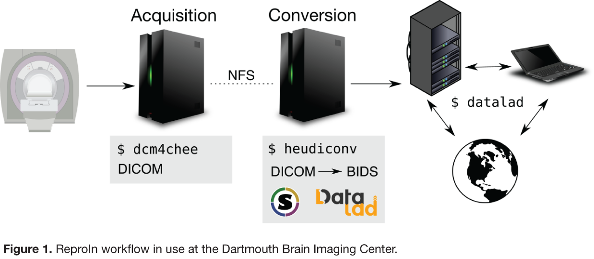
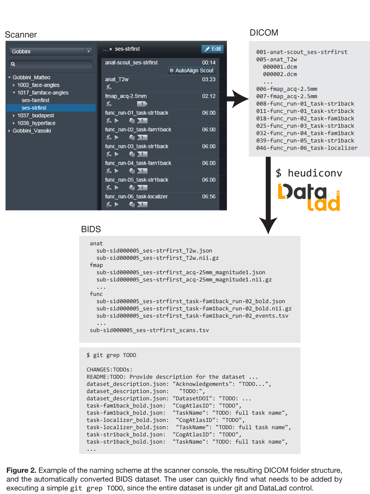

# ReproIn

This project is a part of the [ReproNim Center](http://ReproNim.org)
suite of tools and frameworks.  Its goal is to provide a
turnkey flexible setup for automatic generation of shareable,
version-controlled BIDS datasets from MR scanners.  To not reinvent the wheel,
all actual software development is largely done through contribution to
existing software projects:

- [HeuDiConv]:
  a flexible DICOM converter for organizing brain imaging data into structured
  directory layouts.
  ReproIn [heuristic] was developed and now is shipped within HeuDiConv,
  so it could be used independently of the ReproIn setup on any HeuDiConv
  installation (specify `-f reproin` to heudiconv call).
- [DataLad]:
  a modular version control platform and distribution for both code and
  data.  DataLad support was contributed to HeuDiConv, and could be
  enabled by adding `--datalad` option to the `heudiconv` call.

## Specification

The header of the [heuristic] file describes details of the
specification on how to organize and name study sequences at MR console.

## Overall workflow

Schematic description of the overall setup:

## Tutorial/HOWTO

### Data collection

#### Making your sequence compatible with ReproIn heuristic

- [Walkthrough #1](docs/walkthrough-1.md): guides you through
ReproIn approach to organizing exam cards and managing canceled runs/sessions
on Siemens scanner(s)

#### Renaming sequences to conform the specification needed by ReproIn

TODO: Describe how sequences could be renamed per study by creating a derived
heuristic

### Conversion

1. Install [HeuDiConv] and [DataLad]: e.g.
   `apt-get update; apt-get install heudiconv datalad` in any NeuroDebian environment.
   If you do not have one, you could get either of
   - [NeuroDebian Virtual Machine](http://neuro.debian.net/vm.html)
   - Docker image: `docker run -it --rm -v $PWD:$PWD neurodebian`
   - Singularity image (big but useful), comes with heudiconv and
     datalad preinstalled: `singularity pull shub://neurodebian/neurodebian`

2. Collect a subject/session (or multiple of them) while placing and
   naming sequences in the scanner following the [specification].
   But for now we will assume that you have no such dataset yet, and
   want to try on phantom data:

        datalad install -J3 -r -g ///dicoms/dartmouth-phantoms/bids_test4-20161014

   to get all subdatasets recursively, while getting the data as well
   in parallel 3 streams.
   This dataset is a sample of multi-session acquisition with anatomicals and
   functional sequences on a friendly phantom impersonating two different
   subjects (note: fieldmaps were deficient, without magnitude images).
   You could also try other datasets such as [///dbic/QA]

3. We are ready to convert all the data at once (heudiconv will sort
   into accessions) or one accession at a time.
   The recommended invocation for the heudiconv is

        heudiconv -f reproin --bids --datalad -o OUTPUT --files INPUT

   to convert all found in `INPUT` DICOMs and place then within the
   hierarchy of DataLad datasets rooted at `OUTPUT`.  So we will start
   with a single accession of `phantom-1/`

        heudiconv -f reproin --bids --datalad -o OUTPUT --files bids_test4-20161014/phantom-1

   and inspect the result under OUTPUT, probably best with `datalad ls`
   command:

        ... WiP ...

#### HeuDiConv options to overload autodetected variables:

- `--subject`
- `--session`
- `--locator`

## Sample converted datasets

You could find sample datasets with original DICOMs

- [///dbic/QA] is a publicly
  available DataLad dataset with historical data on QA scans from DBIC.
  You could use DICOM tarballs under `sourcedata/` for your sample
  conversions.
  TODO: add information from which date it is with scout DICOMs having
  session identifier
- [///dicoms/dartmouth-phantoms](http://datasets.datalad.org/?dir=/dicoms/dartmouth-phantoms)
  provides a collection of datasets acquired at [DBIC] to establish
  ReproIn specification.  Some earlier accessions might not be following
  the specification.
  [bids_test4-20161014](http://datasets.datalad.org/?dir=/dicoms/dartmouth-phantoms/bids_test4-20161014)
  provides a basic example of multi-subject and multi-session acquisition.

## Containers/Images etc

This repository provides a [Singularity](./Singualarity) environment
definition file used to generate a complete environment needed to run
a conversion.  But also, since all work is integrated within the
tools, any environment providing them would suffice, such as
[NeuroDebian] docker and Singularity images, virtual appliances, and
other Debian-based systems with NeuroDebian repositories configured,
which would provide all necessary for ReproIn setup components.

## `docker-compose` + usage

This repository provides a `docker-compose` file that includes (2) services:
- DICOM receiver ([dcmtk](https://dicom.offis.de/dcmtk) `storescp`)
  listening and ready to receive through a port.
- `reproin` (`heudiconv`) converter set to process all folders in the DICOM
  directory through a cron job (default is set to everyday at 4am).

Refer to the `.env` file - many options above are configurable within it.

To spin up the reproin service, run `docker-compose up` in the project root -
 this will route all logs to the console. If you wish to run it in the service
 in the background, append the `--detach` flag, and use `docker-compose logs`
 to monitor. Since this is a new feature, it may not behave as intended. If you
 encounter any errors, please open an issue and let us know.

## TODOs/WiP/Related

- [ ] add a pre-configured DICOM receiver for fully turnkey deployments
- [ ] [heudiconv-monitor] to fully automate conversion of the incoming
      data
- [ ] [BIDS dataset manipulation helper](https://github.com/INCF/bidsutils/issues/6)

[HeuDiConv]: https://github.com/nipy/heudiconv
[DataLad]: http://datalad.org
[heuristic]: https://github.com/nipy/heudiconv/blob/master/heudiconv/heuristics/reproin.py
[specification]: https://github.com/nipy/heudiconv/blob/master/heudiconv/heuristics/reproin.py
[heudiconv-monitor]: https://github.com/nipy/heudiconv/blob/master/heudiconv/cli/monitor.py
[DBIC]: http://dbic.dartmouth.edu
[///dbic/QA]: http://datasets.datalad.org/?dir=/dbic/QA
