# Siemens Prisma 3T walkthrough

## Organization

The purpose of the ReproIn effort is to automate as much as possible,
requiring just minimal amount of information entry at the scanner
sufficient to have collected session be placed correctly within a
hierarchy of the datasets, get new data converted to BIDS, and
(optionally) be placed under the version control by
[DataLad](http://datalad.org).

To achieve that first we should make it possible to make DICOMs cary
information about the Investigator (e.g. a PI of the study or a mentor),
possibly corresponding Experimenter (student/assistant or Investigator
himself), and the study (in our case ID-name) itself.

### Tree -> Investigator

To accomplish that, in the Dot Cockpit we first created a dedicated tree
for each Investigator:

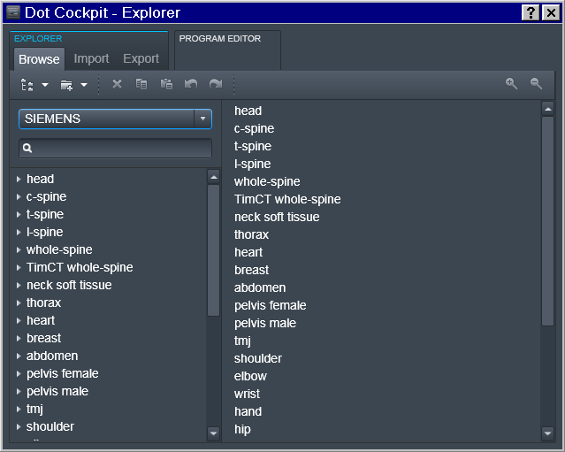

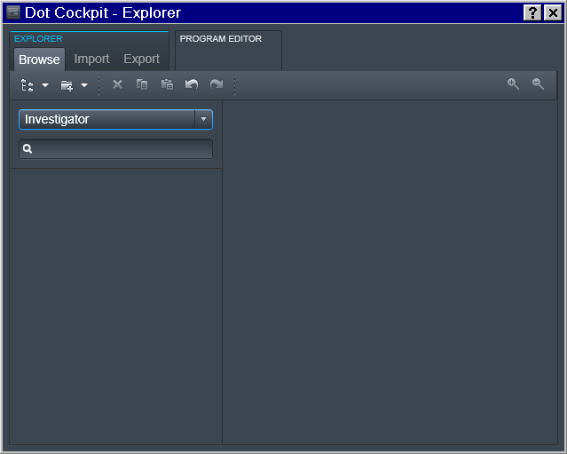

### Region -> Experimenter

Then for a specific Experimenter who is responsible for the study we
defined the 2nd level (Region) entry as a join `Investigator_Experimenter`
entry

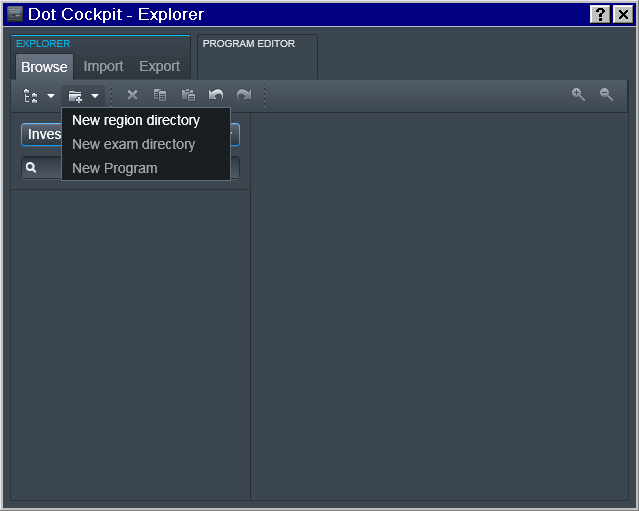

### Exam -> Study

And then at the 3rd level of the Exam we define the study.

Note: you could have multiple entries at any of those levels (e.g.
multiple Experimenters working for the same PI; or multiple studies for
the same Experimenter):

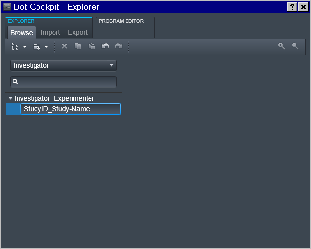

## New Program

Now it is possible to finally define Program(s) with the desired
sequence of protocols:

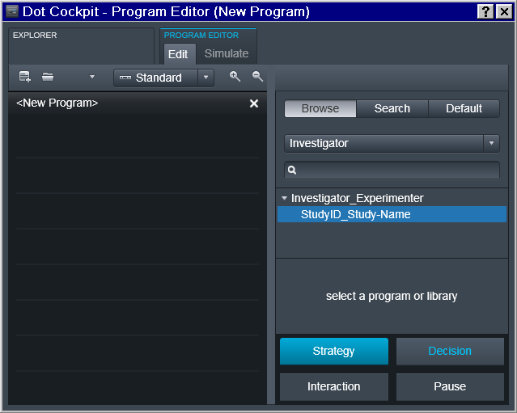

Note that the sequence names follow [reproin
specification](https://github.com/nipy/heudiconv/blob/master/heudiconv/heuristics/reproin.py#L26).
So in the example below it is intended for the first session of a study
collecting a T1 anatomical, a fieldmap, two runs for task1 functional
sequence, then a diffusion image, and completes with a single run for
the functional task2.  Those sequences could be copied from prior/other
studies which might have already followed the naming convention and
otherwise have desired settings:

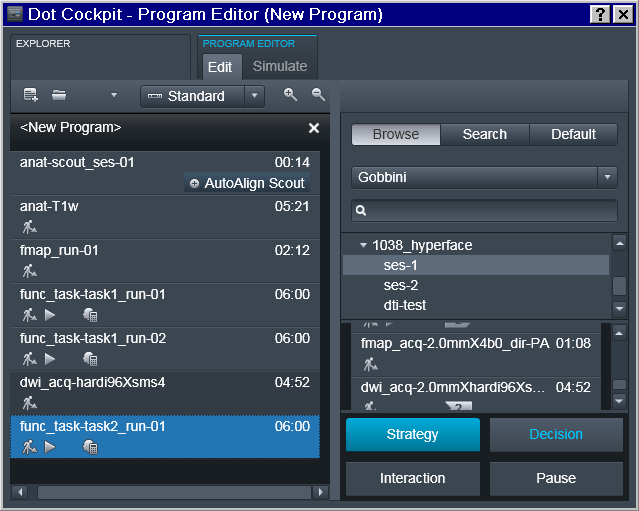

Program should be saved under some descriptive (but otherwise arbitrary)
name.  Note that if the study requires multiple scanning sessions, it is
useful to use `_ses-` suffix to right away depict for which session a
particular program is intended.

### Next Session

Next session program should acquire session marker within the name
of the scout sequence and be saved separately:

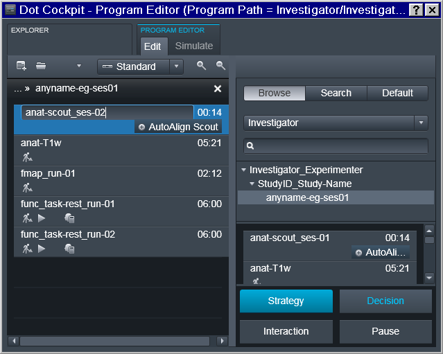

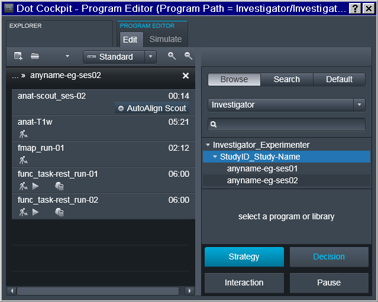

## New Accession

### Register a (New) Subject

In the exam card we enter no personal information to avoid leakage through
DICOMs.  All personal data for a given subject id is stored elsewhere
(`Age` and `Sex` from the exam card though are used to autofill up
`age` and `sex` fields within `participants.tsv`):

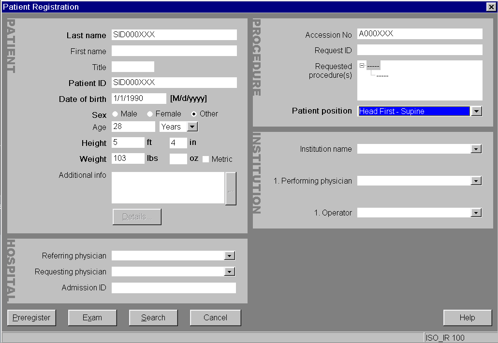

### Choose the Investigator in the Tree

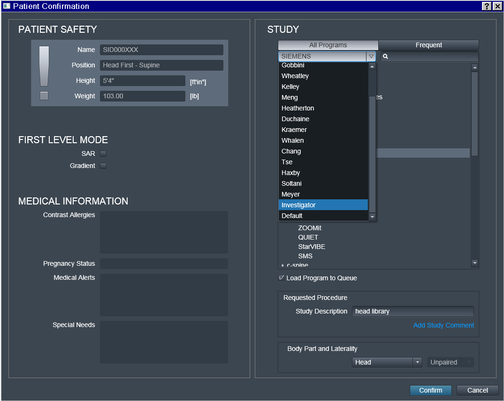

### Choose the desired Program

That is where some "magic" (i.e. automation) happens:
`Investigator_Experimenter` and `StudyID_Study-Name` fields get copied
by the UI into the `Study Description` field which later is included
within transmitted DICOM headers.

Note also that **only** the `Investigator_Experimenter` and
`StudyID_Study-Name` fields get copied into the `Study Description`. The
**Program name** (such as `anuname-eg-ses01`) is **not copied**, and
appears nowhere within DICOM precluding its utility for automation
(hence `anyname` was chosen here for this example).

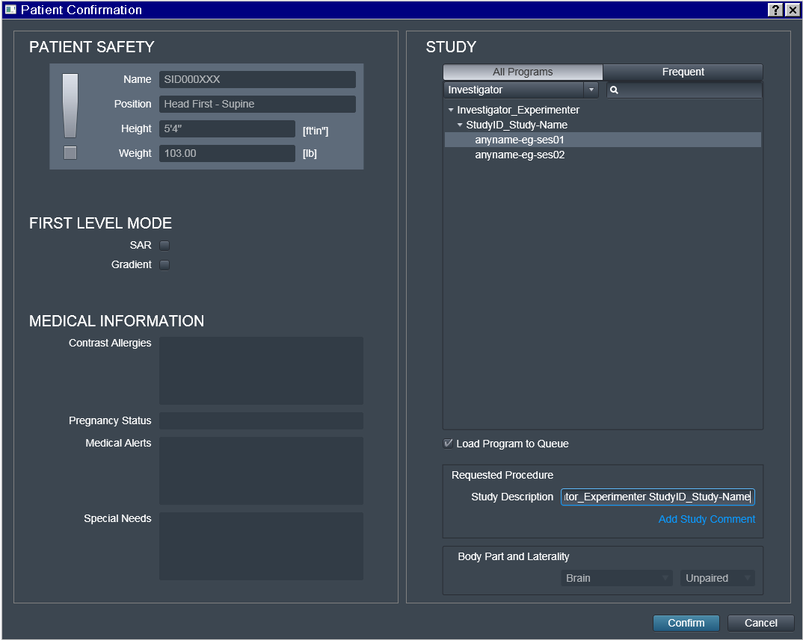

**Do not edit `Study Description`**, unless you really need to and can
*guarantee consistency.  This location will determine the location of
*the dataset on the file system within the hierarchy of (DataLad if ran
*with `--datalad` option) datasets.  Having it this fully automated
*guarantees that for the next subject/session, data will be placed into
*the same dataset without the need to specify target location manually,
*and thus preventing possible human errors.

## Interrupted Scan

As you can see in the following example, we have interrupted
`func_task-task1_run-01` functional scan, may be because our phantom
fell asleep.  Our scanner console is configured to transmit data
immediately upon succesful volume was collected, so those volumes were
already transmitted to PACS:

To make `heudiconv` `reproin` heuristic figure out that the run was
canceled or otherwise needs to be discarded, just `Repeat` the run
**without changing anyting in its name!**:

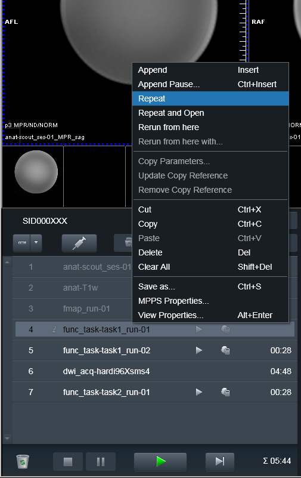

Then, upon conversion, the earlier (e.g. canceled) scans will also be
converted, but assigned `__dupX` suffix (X is an incrementing integer to
allow for possibly multiple canceled runs). This way data curator could
inspect those volumes and if everything matches the notes/sanity checks,
remove those `__dupX` files.  Meanwhile you can proceed with completing
your Program of scans:

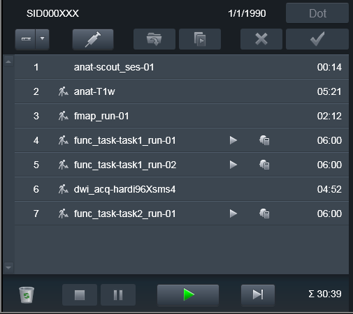

## Interrupted Program

Some times it is necessary to take subject outside of the scanner, and
bring him back later to finish the scanning session.  Typically some volumes
(e.g. at least scouts and fieldmaps) need to be reran.  Because it would be
desired to keep both version of the files -- from both original scanning
session and the continued one -- you would need to `Repeat` those scans
but this time assign them a new suffix.  E.g., you could assign the `_run-`
suffix matching the `run_` suffix of the next functional run, so it would
make it easier later on to associate fieldmaps with the corresponding
functional run file(s).

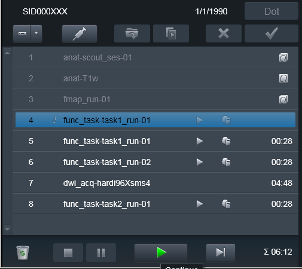

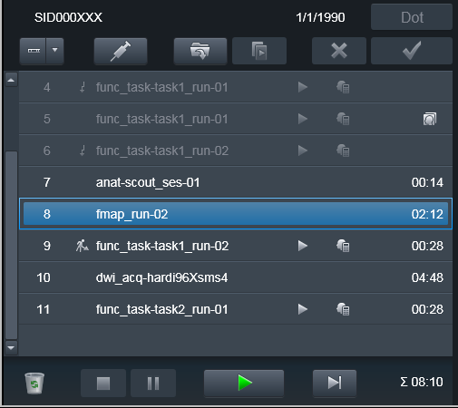

### Done again:

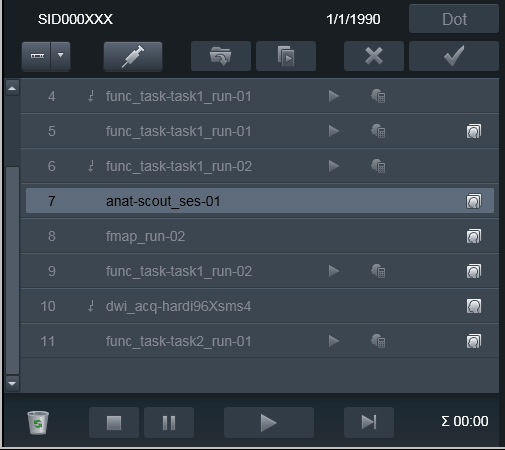

Data was transmitted to PACS and ready for processing using `heudiconv
-f reproin`.